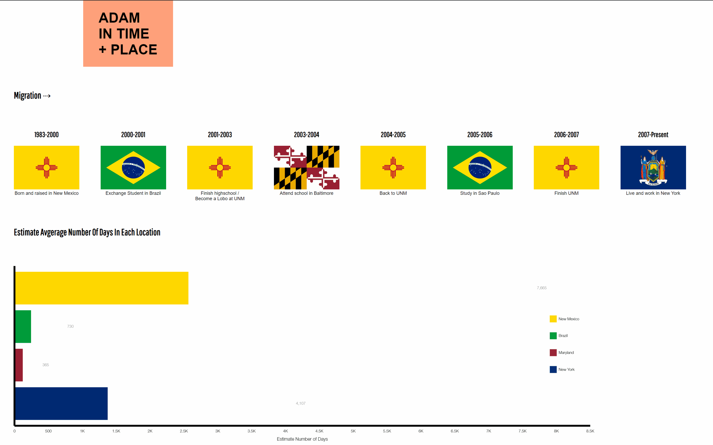

# Adam - InTime + Place

#### Fun page showing the four different places i've considered home and the amount of time in each place (in days). The chart uses the excellent [datavisual](https://datavisu.al/) platform which makes it easy and fast to create animated and interactive charts. 

